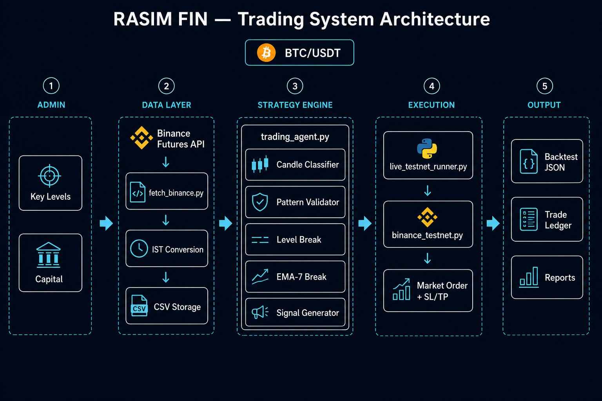
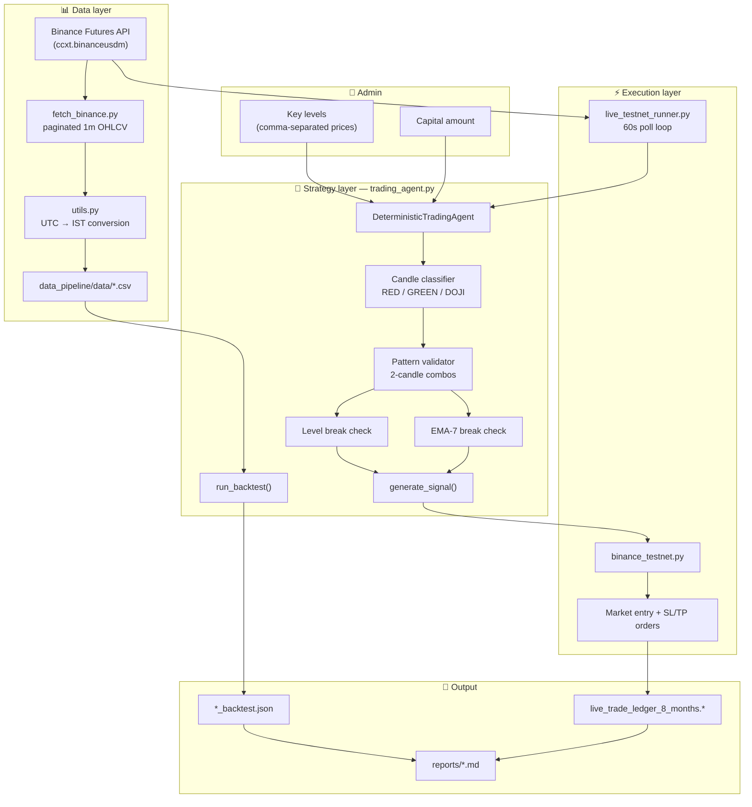
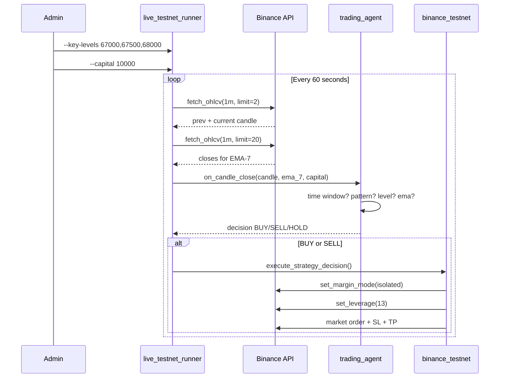

# RASIM FIN — System Architecture & Strategy Guide

**Document version:** 1.0  
**Generated:** 2026-06-08 12:44 IST  
**Stack:** Python 3 · ccxt · pandas · Binance USD-M Futures  

---

## 1. Executive overview

RASIM FIN is an automated **1-minute candle-close** trading system for **BTC/USDT perpetual futures**.  
The admin provides key price levels; the machine evaluates three entry triggers on every candle close inside a fixed IST window and routes orders to Binance (testnet or live) with isolated margin and 13× leverage.

| Layer | Module | Role |
|-------|--------|------|
| Data | `data_pipeline/` | Fetch historical 1m OHLCV, convert to IST, run backtests |
| Strategy | `trading_agent.py` | Candle classification, signal generation, position logic |
| Execution | `binance_testnet.py` | Order placement, SL/TP, margin/leverage config |
| Live loop | `live_testnet_runner.py` | Poll candles, feed agent, execute decisions |
| Reports | `data_pipeline/reports/` | Backtest output, trade ledgers, diagnostics |

---

## 2. Architecture diagram





---

## 3. End-to-end data flow



---

## 4. Strategy specification

### 4.1 Two-step workflow

1. **Admin provides levels** — passed at startup or updated live.
2. **Machine trades** — evaluates entry triggers only on the **second candle** of a valid two-candle pattern.

### 4.2 Entry triggers (all three required)

| # | Trigger | Rule |
|---|---------|------|
| 1 | **Level break** | RED: open below level, close above · GREEN: open above, close below |
| 2 | **Two-candle pattern** | RED→GREEN · GREEN→RED · DOJI→GREEN · DOJI→RED |
| 3 | **EMA-7 break** | Same open/close crossing rules as level break |

### 4.3 Candle definitions

| Type | Definition |
|------|------------|
| RED | Open ≈ low; close within 10% of range from high |
| GREEN | Open ≈ high; close within 10% of range from low |
| DOJI | Open ≈ close (10–20%); open at midpoint |
| HIGH DOJI | Open ≈ close; open at low + range/4; lower half |

### 4.4 Risk parameters

| Parameter | Value |
|-----------|-------|
| Trade window | **18:30 – 21:30 IST** |
| Stop loss | $100 USD PnL |
| Target | $450 USD PnL |
| Risk per trade | 3% of capital |
| Quantity | `(3% × capital) / 100` |
| Leverage | 13× |
| Margin | Isolated |
| Max positions | 1 |

---

## 5. Code walkthrough

### 5.1 Binance data fetch (`data_pipeline/fetch_binance.py`)

Connects to Binance USD-M futures and paginates 1-minute candles with retry logic:

```python
def _binance_futures_client() -> ccxt.binanceusdm:
    return ccxt.binanceusdm({
        "enableRateLimit": True,
        "options": {"defaultType": "future"},
        "timeout": config.REQUEST_TIMEOUT_MS,
    })

def fetch_ohlcv(symbol: str, start_date: str, end_date: str) -> pd.DataFrame:
    exchange = _binance_futures_client()
    markets = _call_with_retries("load_markets", exchange.load_markets)
    # ... paginated loop with since cursor + 1000 candle batches
    df["timestamp"] = df["timestamp_ms"].apply(convert_to_ist)
    return clean_data(df)
```

**Run historical fetch + backtest:**

```bash
.venv/bin/python -m data_pipeline.main \
  --symbol "BTC/USDT:USDT" \
  --start-date 2026-03-01 \
  --end-date 2026-04-01 \
  --capital 10000
```

### 5.2 IST timestamp conversion (`data_pipeline/utils.py`)

```python
IST = pytz.timezone("Asia/Kolkata")

def convert_to_ist(timestamp_ms: int) -> str:
    dt_utc = datetime.fromtimestamp(timestamp_ms / 1000, tz=UTC)
    dt_ist = dt_utc.astimezone(IST)
    return dt_ist.strftime("%Y-%m-%d %H:%M:%S")
```

### 5.3 Strategy constants (`trading_agent.py`)

```python
STOP_LOSS_USD = 100
TARGET_USD = 450
LEVERAGE = 13
RISK_FRACTION = 0.03
TIME_WINDOW_START_IST = time(hour=18, minute=30)  # 6:30 PM IST
TIME_WINDOW_END_IST = time(hour=21, minute=30)    # 9:30 PM IST
```

### 5.4 Level break + EMA break

```python
def check_key_level_break(candle: Candle, key_level: float) -> Dict[str, Any]:
    ctype = classify_candle(candle)
    bullish = (
        candle.open < key_level
        and candle.close > key_level
        and ctype == CandleType.RED
    )
    bearish = (
        candle.open > key_level
        and candle.close < key_level
        and ctype == CandleType.GREEN
    )
    # returns {"direction": "BULLISH"|"BEARISH", "broken": True/False}

def check_ema_break(candle: Candle, ema_7: float) -> Dict[str, Any]:
    ctype = classify_candle(candle)
    bullish = candle.open < ema_7 and candle.close > ema_7 and ctype == CandleType.RED
    bearish = candle.open > ema_7 and candle.close < ema_7 and ctype == CandleType.GREEN
```

### 5.5 Pattern validation

```python
def validate_pattern(prev_type, current_type) -> bool:
    allowed = {
        (CandleType.RED, CandleType.GREEN),
        (CandleType.GREEN, CandleType.RED),
        (CandleType.DOJI, CandleType.GREEN),
        (CandleType.DOJI, CandleType.RED),
    }
    return (prev_type, current_type) in allowed
```

### 5.6 Position sizing

```python
def calculate_quantity(capital: float) -> float:
    return (RISK_FRACTION * capital) / STOP_LOSS_USD
    # Example: (0.03 × 10000) / 100 = 3.0 contracts
```

### 5.7 Live runner (`live_testnet_runner.py`)

```python
agent = DeterministicTradingAgent(key_levels=levels)

while True:
    prev_candle, current_candle = _latest_prev_and_current(symbol)
    ema_7 = _latest_ema7(symbol)
    decision = agent.on_candle_close(
        candle=current_candle,
        ema_7=ema_7,
        capital=capital,
        timestamp_ist=current_candle.timestamp_ist,
    )
    execute_strategy_decision(exchange, symbol, decision)
    time.sleep(60)
```

### 5.8 Order execution (`binance_testnet.py`)

```python
def _configure_symbol_risk(exchange, symbol):
    exchange.set_margin_mode("isolated", symbol)
    exchange.set_leverage(LEVERAGE, symbol)  # 13x

def execute_strategy_decision(exchange, symbol, decision):
    # Market entry at candle close
    entry_order = exchange.create_order(symbol, "market", side, amount=quantity)
    # Attached reduce-only SL and TP based on $100 / $450 USD PnL
    sl_order = exchange.create_order(..., type="STOP_MARKET", params={"reduceOnly": True})
    tp_order = exchange.create_order(..., type="TAKE_PROFIT_MARKET", params={"reduceOnly": True})
```

---

## 6. Project structure

```
RASIM_FIN_2/
├── trading_agent.py          # Core strategy + backtest engine
├── binance_testnet.py        # Testnet order execution
├── live_testnet_runner.py    # Live 1m polling loop
├── diagnostic_report.py      # Signal frequency diagnostics
├── generate_extensive_reports.py
├── data_pipeline/
│   ├── main.py               # Fetch + backtest CLI
│   ├── fetch_binance.py      # ccxt OHLCV pagination
│   ├── config.py             # Defaults
│   ├── utils.py              # IST conversion, cleaning
│   ├── data/                 # CSV + backtest JSON output
│   └── reports/              # Generated reports
└── tests/
    ├── test_strategy_spec.py
    └── test_admin_levels_strategy.py
```

---

## 8. Deployment checklist

1. Create `.venv` and `pip install -r requirements.txt`
2. Set `BINANCE_TESTNET_API_KEY` and `BINANCE_TESTNET_API_SECRET`
3. Admin provides today's key levels
4. Start runner:
   ```bash
   .venv/bin/python live_testnet_runner.py \
     --symbol "BTC/USDT:USDT" \
     --capital 10000 \
     --key-levels "67000,67500,68000,68500,69000"
   ```
5. Monitor `[decision]` and `[execution]` logs each minute
6. Run periodic backtests via `data_pipeline.main` to validate rule changes

---

## 9. Related reports

| File | Contents |
|------|----------|
| `live_trade_ledger_8_months.md` | Full trade-by-trade ledger (Aug 2025 – Mar 2026) |
| `live_trade_ledger_8_months.json` | Machine-readable trade log |
| `live_trade_ledger_8_months.csv` | Spreadsheet import |
| `end_to_end_trade_logic_report.md` | Detailed rule documentation |

---

*End of system architecture guide.*
